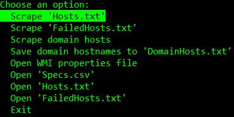
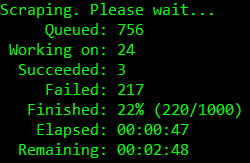
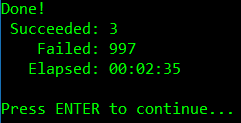

# System Specs Scraper

Easily get the specs of all Windows computers on your network.

The program outputs a CSV table file.

## Requirements

For this program to work, WMI connections need to be allowed on remote computers. Here is the official Microsoft guide on how to do it:
[Setting up a Remote WMI Connection](https://docs.microsoft.com/en-us/windows/win32/wmisdk/connecting-to-wmi-remotely-starting-with-vista)

## Choosing WMI Properties to Scrape

After opening the program, a file named `WMI_Namespaces.xml` will be generated in the executable folder. Edit the file with your desired WMI namespaces, classes, and properties. The value of the  `displayName` attribute of the properties is the header of the column in the output CSV file.

A tool by Microsoft can be used to find the available WMI namespaces, classes, and properties. The tool also allows checking what a specific WMI property would return. The tool can be downloaded [here](https://www.microsoft.com/en-us/download/details.aspx?id=8572).

### Example of `WMI_Namespaces.xml`

```xml
<?xml version="1.0" encoding="utf-8" ?>
<Namespaces>
  <Namespace name="CIMV2">
    <Class name="Win32_Processor">
      <Property name="Name" displayName="CPU"/>
    </Class>
    <Class name="Win32_OperatingSystem">
      <Property name="TotalVisibleMemorySize" displayName="RAM"/>
      <Property name="Version" displayName="OS Version"/>
    </Class>
  </Namespace>
</Namespaces>
```

## Output File Example (`Specs.csv`)

When using the above `WMI_Namespaces.xml` file, the following output will be generated:

```cs
"Host","CPU","RAM","OS Version","DateTime"
"computerName1","Intel(R) Core(TM) i7-4510U CPU @ 2.00GHz","16778904","10.0.18363","2020-03-07 10:19:18"
"computerName2","Intel(R) Core(TM) i9-9310X CPU @ 4.50GHz","8326899","10.0.18245","2020-03-07 10:19:19"
"computerName3","Intel(R) Core(TM) i5-6420P CPU @ 3.10GHz","32148499","10.0.17920","2020-03-07 10:19:20"
```

which will look like this in a spreadsheet software:

Host|CPU|RAM|OS Version|DateTime
-|-|-|-|-
computerName1|Intel(R) Core(TM) i7-4510U CPU @ 2.00GHz|16778904|10.0.18363|2020-03-07 10:19:18
computerName2|Intel(R) Core(TM) i9-9310X CPU @ 4.50GHz|8326899|10.0.18245|2020-03-07 10:19:19
computerName3|Intel(R) Core(TM) i5-6420P CPU @ 3.10GHz|32148499|10.0.17920|2020-03-07 10:19:20

## Screenshots







## Notes

* Computer names, IPv4 addresses, and IPv6 addresses work fine.
* The `Scrape domain hosts` option will read all host names using LDAP from the directory and get the specs for these hosts. This option will be disabled for computers that are not connected to a domain.
* `FailedHosts.txt` file will be generated with all the computers for which the program was not able to get specs.
* The `Scrape failed 'FailedHosts.txt'` option will read the `FailedHosts.txt` file and get the specs for these hosts.
* (Optional) The first command line argument is the path to a file that contains hostnames - one hostname per line. When using this option, the program will not show the last screen and wait for input but will end instead.
